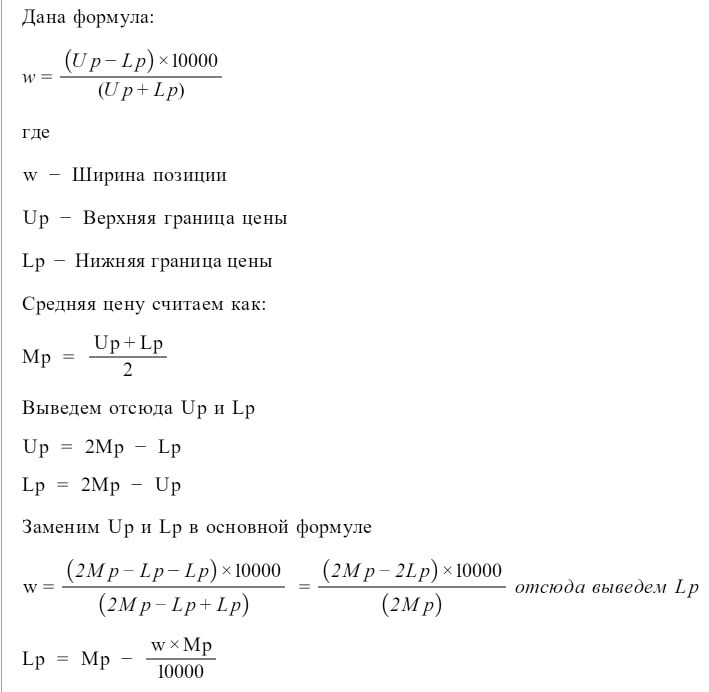
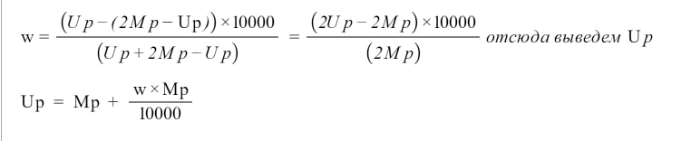

# Формулы




# Контракт
Основной контракт UniswapV3LiquidityManager находиться в папке conracts  

## Функции
addLiquidity  - Добавление ливдности  
calculatePriceRange - Расчет ценовых диапозонов  
calculateSqrtPriceX96 - Стандартная функция библиотеки TickMath для расчета sqrtPriceX96 (для теста)  
sqrt - Расчет корня числа (для более ранних версий Solidity)  

## Как добавляем ликвидность
Исходя из данной мне формулы, можно сказать, что ширина(w) будет всегда меньше 10000, добавляем проверку на вылидность значения  
За среднюю цену берем актуальную цену из пула  
Расчитываем lowerPrice и upperPrice согласно выше написаным формулам  
Переводи цены в необходимый формат и расчитываем тики с помощью библиотеки TickMath  
Далее вызываем функцию mint в контракте NonfungiblePositionManager

# Тесты
Для тестов и компиляции контрактов я использовал hardhat, а также библиотеку hardhat-uniswap для деплоя билиотеки uniswap (hardhat-uniswap не поддерживал новые версии hardhat, поэтоиу пришлось отредактировать библиотеку для успешного деплоя)  
В тестах имитируем создание двух токенов и пула  
Первый тест проверяет успешное добавление ликыидности в пул  
Второй тест проверяет корректность ширины позиции, для этого я в обратном порядке получаю цены из граничных тиков, и расчитываю ширину согласно данной формуле  
Функция getTickAtSqrtRatio в библиотеке TickMath расчитывает самый большой тик для цены, поэтому при оброатном действии возникает погрешность, которая учитывается в тесте
Остальные виды тестов (покрытие, синтаксис и тд) не прописывал, так как задание не требует
# Запуск
```
npm install
npx hardhat test
```
